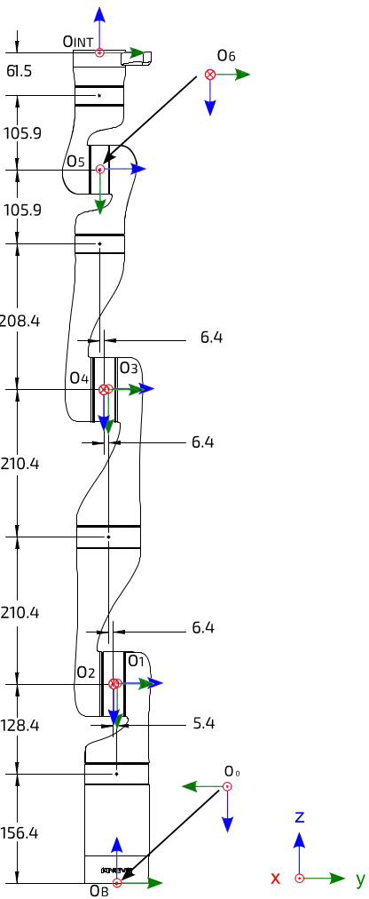
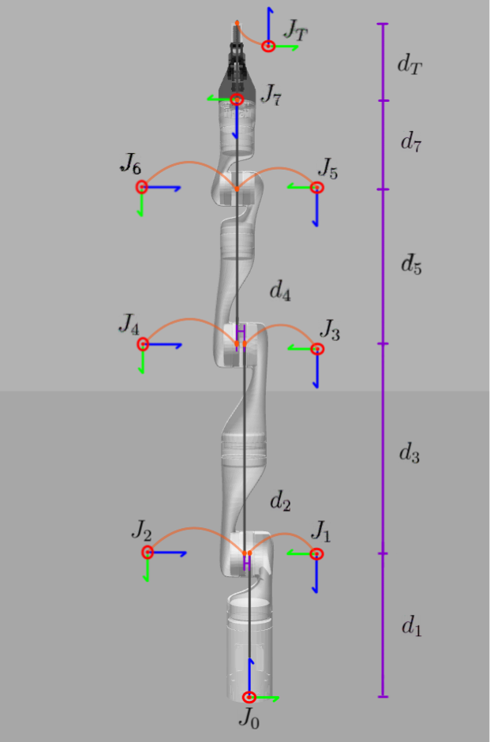

# Repository to Verify Forward Kinematics of Devanit-Hartenberg Parameterization
The <em>manipulator</em>_main.m scripts (in the [scripts folder](scripts/)) computes and plot the forward kinematics (defined in [`FwdKin.m`](functions/FwdKin.m)) from the Devanit-Hartenberg (DH) parameters of the manipulator.

## Kinova Gen3 Manipulator Specifics
The kinematic table for the conventional DH parameterization is found on page 204 of the [`Kinova-Gen-3_User-Guide`](documentation/Kinova-Gen-3_User-Guide.pdf) and the corresponding frame definitions are found on page 205 and shown below:

The modified DH frame definitions are shown below:

